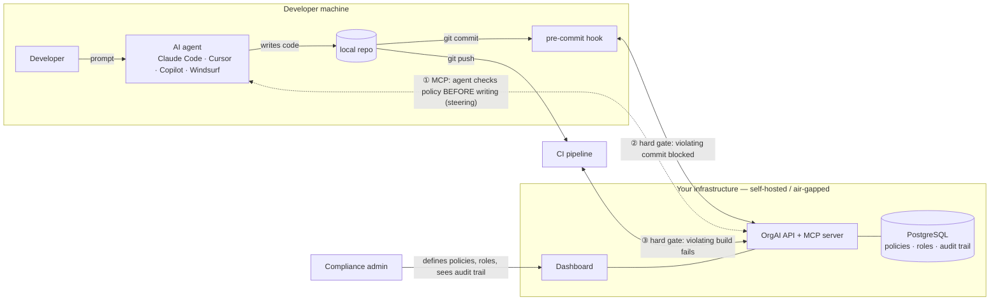

# OrgAI

**Self-hosted AI compliance enforcement for engineering teams.**

Your developers use Claude Code, Cursor, Copilot, Windsurf. OrgAI lets the organization define coding policies once — centrally, per role — and enforces them across every AI agent, every commit, and every CI run. With an append-only audit trail of what was checked, what was blocked, and who bypassed what.

- **Steer the agents**: an MCP server any MCP-compatible agent connects to (Claude Code, Cursor, Copilot agent mode, Windsurf) — agents check policy before writing code.
- **Enforce at the gate**: a git pre-commit hook and CI check are the hard enforcement layer. Agent steering is advisory; the hook and CI are not.
- **Prove it happened**: every check, violation, and bypass (`COMPLY_SKIP` is logged, not silent) lands in an append-only audit trail — evidence for SOC 2 / ISO 27001 / HIPAA / DPDP audits. Evidence, not certification.
- **Roles that match your org**: policies attach to roles, roles inherit, and a member can hold multiple roles across departments — union of policies, strictest wins.
- **Self-hosted**: runs in your VPC or fully air-gapped. Your code never leaves your infrastructure. Policy checks are deterministic pattern/AST rules — no LLM calls, no token spend, sub-second.

## Where it sits



**①** Agent asks OrgAI what the developer's role allows *before* generating code — advisory steering, catches violations at the source.
**②③** Git hook and CI re-check deterministically — the hard enforcement. An agent (or human) that ignores steering gets blocked at commit and again at build. Every check and every bypass lands in the audit trail.

## Architecture

```text
orgai-platform/
├── packages/core/   Shared policy engine + evaluator
├── api/             REST API + MCP server (Express + Prisma + PostgreSQL)
├── dashboard/       Web dashboard (Next.js)
├── mcp/             Standalone MCP CLI (orgai-comply)
└── extension/       VS Code extension (optional, cloud-LLM based — separate from the self-hosted enforcement path)
```

## Quick start

One command — starts PostgreSQL (Docker/Podman), runs migrations, boots API + dashboard with hot reload:

```bash
git clone https://github.com/MrKuros/orgai-platform
cd orgai-platform
./dev.sh
# API:       http://localhost:8080
# Dashboard: http://localhost:3000
# Stop:      ./dev.sh --down
```

Or with docker-compose: `cp .env.example .env && docker-compose up`.

## Connect a developer

One command per developer — configures their MCP clients and installs the pre-commit hook:

```bash
curl -fsSL https://<your-orgai-host>/setup.sh | bash -s -- --key oai_xxx --role backend-dev
```

Manual MCP configuration (Cursor, Claude Code, Windsurf — any MCP client):

```json
{
  "mcpServers": {
    "orgai": {
      "url": "https://<your-orgai-host>/mcp",
      "headers": { "x-api-key": "oai_your_key_here" }
    }
  }
}
```

For Copilot agent mode, the setup script writes `.vscode/mcp.json` automatically.

See [DEVELOPER_SETUP.md](DEVELOPER_SETUP.md) for the full onboarding guide and [FEATURES.md](FEATURES.md) for the complete feature inventory.

## Production deployment

Self-hosted bundle — build an offline installer tarball (Docker/Podman, install scripts for Linux/Windows):

```bash
./selfhost/build-bundle.sh
```

Works fully air-gapped. See `selfhost/` for details.

## CI

GitHub Actions builds and tests everything on every push: API (against a real PostgreSQL), MCP, dashboard build + lint, browser e2e suite, and the VS Code extension. CI is build + test only — no deployments run from this repository.

## License

[MIT](LICENSE) — use it, fork it, run it inside your company.

Paid deployment, policy tuning, and support: **kashish.patel@orgai.dev**
