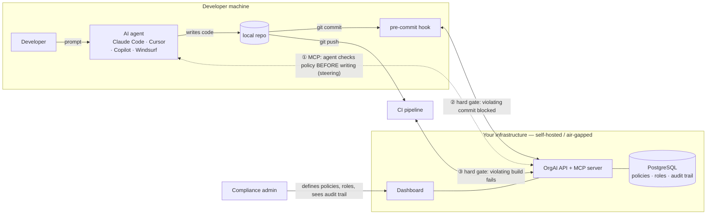

<div align="center">

# OrgAI

**Self-hosted AI compliance enforcement for engineering teams.**

One policy source. Every AI agent. Every commit. Proven in an append-only audit trail.

[](https://github.com/MrKuros/orgai-platform/actions/workflows/ci.yml)
[](LICENSE)
[](#connect-a-developer)
[](#production-deployment)

[**orgai.dev**](https://orgai.dev) · [Quick start](#quick-start) · [How it works](HOW_IT_WORKS.md) · [Features](FEATURES.md) · [Developer setup](DEVELOPER_SETUP.md) · [Contact](mailto:kashish.patel@orgai.dev)

</div>

---

Your developers use Claude Code, Cursor, Copilot (agent mode), Windsurf. OrgAI lets the organization define coding policies once — centrally, per role — and enforces them across every AI agent, every commit, and every CI run.

|  | Layer | How | Guarantee |
|---|---|---|---|
| ① | **Agent steering** | MCP server any MCP-compatible agent connects to | Agents check policy *before* writing code — violations caught at the source |
| ② | **Commit gate** | Git pre-commit hook | Violating commits blocked. Bypass (`COMPLY_SKIP`) is logged, never silent |
| ③ | **Build gate** | CI check | Final backstop — violating builds fail |

Every check, violation, and bypass lands in an **append-only audit trail** — evidence for SOC 2 / ISO 27001 / HIPAA / DPDP audits. Evidence, not certification.

**Roll out policies safely:** start a new policy in **shadow mode** — it's evaluated on every check and would-have-blocked hits are audit-logged, but nothing blocks. Watch its noise in the audit trail, then flip it to enforced. Or import a **starter pack** (HIPAA, PCI DSS, DPDP, baseline security) — packs land in shadow mode. Community packs welcome: plain-JSON PRs against [`api/src/policy-packs/`](api/src/policy-packs/).

**Know who did what:** issue each developer a **member-bound API key** — their checks run as their assigned roles automatically and the audit trail names them, commit bypasses included. Deactivate a member and their access + keys stop working instantly.

**Why it's fast and free to run:** policy checks are deterministic pattern/AST rules — no LLM calls, no token spend, sub-second. **Why it's private:** runs in your VPC or fully air-gapped; your code never leaves your infrastructure.

## Where it sits



**①** Agent asks OrgAI what the developer's role allows *before* generating code — advisory steering, catches violations at the source.
**②③** Git hook and CI re-check deterministically — the hard enforcement. An agent (or human) that ignores steering gets blocked at commit and again at build.

## Roles that match your org

Policies attach to roles, roles inherit, and a member can hold **multiple roles across departments** — they get the union of all their policies, strictest wins. A payments engineer who also touches the data platform inherits both rulebooks automatically.

## Architecture

```text
orgai-platform/
├── packages/core/   Shared policy engine + evaluator
├── api/             REST API + MCP server (Express + Prisma + PostgreSQL)
├── dashboard/       Web dashboard (Next.js)
├── mcp/             Standalone MCP CLI (orgai-comply)
└── extension/       VS Code extension (optional, cloud-LLM based — separate from the self-hosted enforcement path)
```

## Quick start

One command — starts PostgreSQL (Docker/Podman), runs migrations, boots API + dashboard with hot reload:

```bash
git clone https://github.com/MrKuros/orgai-platform
cd orgai-platform
./dev.sh
# API:       http://localhost:8080
# Dashboard: http://localhost:3000
# Stop:      ./dev.sh --down
```

Or with docker-compose: `cp .env.example .env && docker-compose up`.

## Connect a developer

One command per developer — configures their MCP clients and installs the pre-commit hook:

```bash
curl -fsSL https://<your-orgai-host>/setup.sh | bash -s -- --key oai_xxx --role backend-dev
```

Manual MCP configuration (Cursor, Claude Code, Windsurf — any MCP client):

```json
{
  "mcpServers": {
    "orgai": {
      "url": "https://<your-orgai-host>/mcp",
      "headers": { "x-api-key": "oai_your_key_here" }
    }
  }
}
```

For Copilot agent mode, the setup script writes `.vscode/mcp.json` automatically.

See [DEVELOPER_SETUP.md](DEVELOPER_SETUP.md) for the full onboarding guide and [FEATURES.md](FEATURES.md) for the complete feature inventory.

## Production deployment

Self-hosted bundle — build an offline installer tarball (Docker/Podman, install scripts for Linux/Windows):

```bash
./selfhost/build-bundle.sh
```

Works fully air-gapped. See `selfhost/` for details.

## CI

GitHub Actions builds and tests everything on every push: API (against a real PostgreSQL), MCP, dashboard build + lint, browser e2e suite, and the VS Code extension. CI is build + test only — no deployments run from this repository.

---

<div align="center">

**[MIT licensed](LICENSE)** — use it, fork it, run it inside your company.

Running this in your company? Paid deployment, policy tuning, and support:
[**kashish.patel@orgai.dev**](mailto:kashish.patel@orgai.dev) · [**orgai.dev**](https://orgai.dev)

</div>
